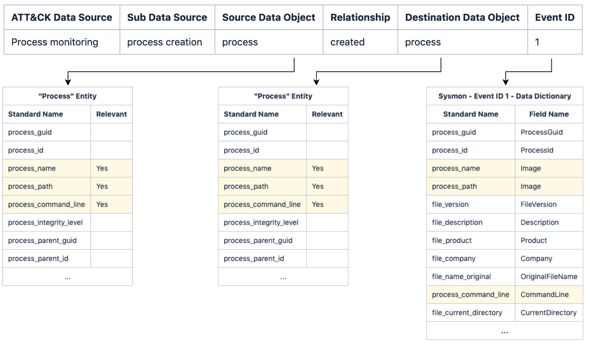
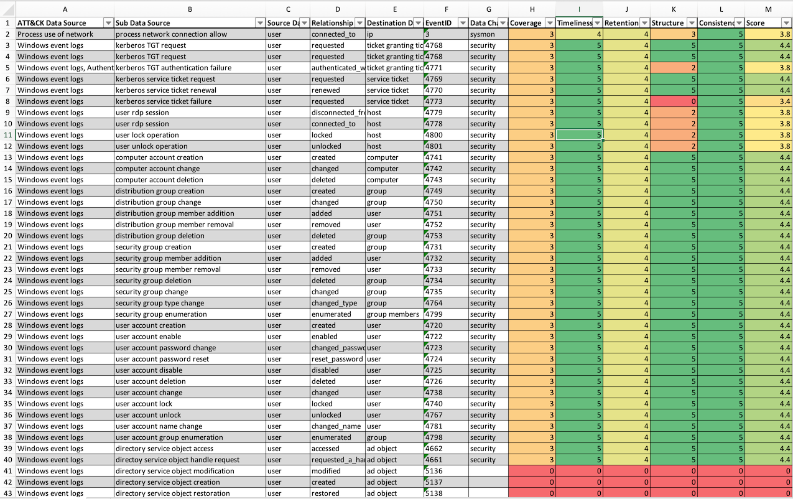
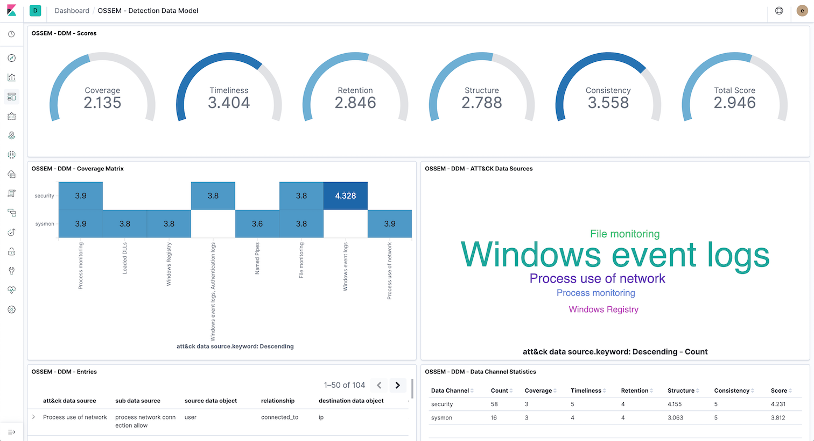
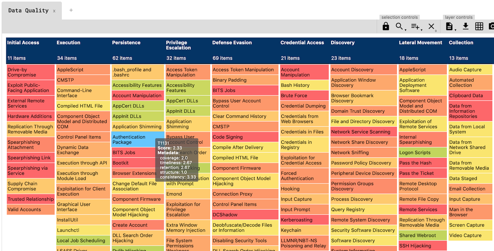

# **OSSEM** 
A tool to assess data quality, built on top of the awesome [OSSEM](https://github.com/hunters-forge/OSSEM) project.

# Mission
* Answer the question: I want to start hunting ATT&CK techniques, what log sources and events are more suitable?
* Create transparency on the strengths and weaknesses of your log sources
* Provide an easy way to evaluate your logs

# OSSEM **Power-up** Overview
**Power-up** uses OSSEM [Detection Data Model](https://github.com/hunters-forge/OSSEM/tree/master/detection_data_model) (DDM) as the foundation of its data quality assessment. The main reason for this is because it provides a structured way to correlate [ATT&CK Data Sources](https://github.com/hunters-forge/OSSEM/tree/master/attack_data_sources), [Common information model entities](https://github.com/hunters-forge/OSSEM/tree/master/common_information_model) (CIM), and [Data Dictionaries](https://github.com/hunters-forge/OSSEM/tree/master/data_dictionaries) (events) with each other.

For those unfamiliar the DDM structure, here is a sample:

|ATT&CK Data Source|Sub Data Source|Source Data Object|Relationship|Destination Data Object|EventID|
|------------------|---------------|------------------|------------|---------------------|-------|
|Process monitoring|process creation|process|created|process|4688|
|Process monitoring|process creation|process|created|process|1|
|Process monitoring|process termination|process|terminated|-|4689|
|Process monitoring|process termination|process|terminated|-|5|

As you can see each entry in the DDM defines a sub data source (scope) using abstract entities like process, user, file, etc. Each of these entries also contain an event ID, where the scope applies. You can read more about these entitites [here](https://github.com/hunters-forge/OSSEM/tree/master/common_information_model).

In a nutshell, DDM entries play a major role on removing the complexity of raw events, by providing a *scope* that defines how a log source (data channels) can be consumed.

# Data Quality Dimensions
**Power-up** assesses data quality score according to **five** distinct dimensions:

|Dimension|Type|Description|
|---------|----|-----------|
|Coverage|Data channel|How many devices or network segments are covered by the data channel|
|Timeliness|Data channel|How long does it take for the event to be available|
|Retention|Data channel|How long does the event remain available|
|Structure|Event|How complete is the event, if relevant fields are available|
|Consistency|Event|How standard are the event fields, if fields have been normalized|

Every dimension is rated with a score between 0 (none) to 5 (excelent).

## Coverage, Timeliness and Retention
These dimensions are tied to data channels, and propagate to all events provided by it.

Due to the nature of these dimensions, they must be rated manually, according to the specifities of the data channels.

**Power-up** uses `resources/dcs.yml` to define data channel and rate the dimensions:
```yaml 
data channel: sysmon
description: sysmon monitoring
coverage: 2
timeliness: 5
retention: 2
---
data channel: security
description: windows security auditing
coverage: 5
timeliness: 5
retention: 2
```

## Structure
In order to calculate how complete the event structure is, **power-up** compares the data dictionary **standard names** with the fields of the **entities** (CIM) referenced in the DDM entry (source and destination).

Because not all **entity** fields are relevant (depends on the context), **power-up** uses the concept of **profiles** to select which fields need to match the data dictionary standard names. For example:
```yaml
# OSSEM CIM Profile
process:
    - process_name
    - process_path
    - process_command_line
```
> **Note**: There is an example profile in `profiles/default.yml` for you to play with.

The structure score is calculated with the following formula:

```SCORE_PERCENT = (MATCHED_FIELDS / TOTAL_RELEVANT_FIELDS) * 100```

For the sake of clarity, here is an example of how structure score is calculated:


> **Note**: Because Sysmon **Event Id 1** data dictionary matches 100% of the relevant entity fields, the structure score will be rated as 5 (excelent).

The structure score is translated to the 0-5 scale in the following way:

|Percentage|Score|
|----------|-----|
|0|0|
|1 to 25|1|
|26 to 50|2|
|51 to 75|3|
|76 to 99|4|
|100|5|

> **Note**: Depending on the use case (SIEM, Threat Hunting, Forensics), you can define different profiles so that you can rate your logs differently.

## Consistency
To calculate consistency, **power-up** simply calculates the percentage of fields with a **standard name** in a data dictionary. Data dictionaries with a high number of fields mapped to a standard name are more likely to correlate with CIM entities.

The consistency score is calculated with the following formula:

```SCORE_PERCENT = (STANDARD_NAME_FIELDS / TOTAL_FIELDS) * 100```

The consistency score is translated to the 0-5 scale in the following way:

|Percentage|Score|
|----------|-----|
|0|0|
|1 to 50|1|
|51 to 99|3|
|100|5|

# How to use
## Before you start
* **Power-up** is a python script, be sure to `pip install -r requirements.txt`
* Be sure to have a local copy of [OSSEM repository](https://github.com/hunters-forge/OSSEM)

## Running **power-up**
```
$> python3 powerup.py --help
  _____ _____ _____ _____ _____    _____ _____ _ _ _ _____ _____     _____ _____ __
 |     |   __|   __|   __|     |  |  _  |     | | | |   __| __  |___|  |  |  _  |  |
 |  |  |__   |__   |   __| | | |  |   __|  |  | | | |   __|    -|___|  |  |   __|__|
 |_____|_____|_____|_____|_|_|_|  |__|  |_____|_____|_____|__|__|   |_____|__|  |__|

usage: powerup.py [-h] [-o OSSEM] [-y OSSEM_YAML] [-p PROFILE] [--excel]
                  [--elastic] [--yaml]

A tool to assess ATT&CK data source coverage, built on top of awesome OSSEM.

optional arguments:
  -h, --help            show this help message and exit
  -o OSSEM, --ossem OSSEM
                        path to import OSSEM markdown
  -y OSSEM_YAML, --ossem-yaml OSSEM_YAML
                        path to import OSSEM yaml
  -p PROFILE, --profile PROFILE
                        path to CIM profile
  --excel               export OSSEM DDM to excel
  --elastic             export OSSEM data models to elastic
  --yaml                export OSSEM data models to yaml
  --layer               export OSSEM data models to navigator layer
```

As you can see **power-up** can consume OSSEM data from two different formats:
* OSSEM markdown - The native format of OSSEM when you clone from git.
* OSSEM yaml - A sumarized format of OSSEM, only the data fields and a few metadata. You can **power-up** to convert OSSEM markdown to yaml.

Currently, **Power-up** exports OSSEM output to:
* Yaml - Creates OSSEM structures in yaml, in the `output/` folder
* Excel - Creates an OSSEM DDM table, enriched with the data quality scores, in the `ouput/` folder
* Elastic - Creates an OSSEM structure in elastic, the indexes are as follows:
    * ossem.ddm - OSSEM DDM table, enriched with the data quality scores
    * ossem.cim - OSSEM CIM entries
    * ossem.dds - OSSEM Data Dictionaries
    * ossem.dcs - OSSEM Data Channels

> **Note**: if no profile file path is specified **power-up** uses `profiles/default.yml` by default.

### Exporting to YAML
```
$> python3 powerup.py -o ../OSSEM --yaml
  _____ _____ _____ _____ _____    _____ _____ _ _ _ _____ _____     _____ _____ __
 |     |   __|   __|   __|     |  |  _  |     | | | |   __| __  |___|  |  |  _  |  |
 |  |  |__   |__   |   __| | | |  |   __|  |  | | | |   __|    -|___|  |  |   __|__|
 |_____|_____|_____|_____|_|_|_|  |__|  |_____|_____|_____|__|__|   |_____|__|  |__|

[*] Profile path: profiles/default.yml
[*] Parsing OSSEM from markdown
[*] Exporting OSSEM to YAML
[*] Created output/ddm_20191114_160246.yml
[*] Created output/cim_20191114_160246.yml
[*] Created output/dds_20191114_160246.yml
```

The goal of exporting/importing to/from YAML is to facilitate OSSEM customization. Chances are that the first you will do is create your own data dictionaries, and then add new DDM entries, so YAML will make updates easier.

> **Note 1:** modify `resources/config.yml` to instruct **power-up** about the file names for the correct structures. Then you just need to place then in a folder and pass to OSSEM_YAML argument.

> **Note 2:** **power-up** does not parse the entire OSSEM objects to YAML, only the data fields and some metadata (i.e. description). The reason for this is that I wanted to keep the YAML object as lean as possible, just with the data you need to assess data quality.

### Exporting to EXCEL
```
$> python3 powerup.py -o ../OSSEM --excel
  _____ _____ _____ _____ _____    _____ _____ _ _ _ _____ _____     _____ _____ __
 |     |   __|   __|   __|     |  |  _  |     | | | |   __| __  |___|  |  |  _  |  |
 |  |  |__   |__   |   __| | | |  |   __|  |  | | | |   __|    -|___|  |  |   __|__|
 |_____|_____|_____|_____|_|_|_|  |__|  |_____|_____|_____|__|__|   |_____|__|  |__|

[*] Profile path: profiles/default.yml
[*] Parsing OSSEM from markdown
[*] Exporting OSSEM DDM to Excel
[*] Saved Excel to output/ddm_enriched_20191114_160041.xlsx
```

When exporting to Excel, **power-up** will create an eye-candy DDM, with the respective data quality dimensions for every entry:


### Exporting to ELASTIC
```
$> python3 powerup.py -o ../OSSEM --elastic
  _____ _____ _____ _____ _____    _____ _____ _ _ _ _____ _____     _____ _____ __
 |     |   __|   __|   __|     |  |  _  |     | | | |   __| __  |___|  |  |  _  |  |
 |  |  |__   |__   |   __| | | |  |   __|  |  | | | |   __|    -|___|  |  |   __|__|
 |_____|_____|_____|_____|_|_|_|  |__|  |_____|_____|_____|__|__|   |_____|__|  |__|

[*] Profile path: profiles/default.yml
[*] Parsing OSSEM from markdown
[*] Exporting OSSEM to Elastic
[*] Creating elastic index ossem.ddm
[*] Creating elastic index ossem.cim
[*] Creating elastic index ossem.dds
[*] Creating elastic index ossem.dcs
```

When exporting to Elastic, **power-up** will store all OSSEM data in elastic. Because the DDM is also enriched with the respective data quality dimensions, you will be able to create dashboards like this:


### Exporting to ATT&CK Navigator
```
$> python3 powerup.py -o ../OSSEM --layer
  _____ _____ _____ _____ _____    _____ _____ _ _ _ _____ _____     _____ _____ __
 |     |   __|   __|   __|     |  |  _  |     | | | |   __| __  |___|  |  |  _  |  |
 |  |  |__   |__   |   __| | | |  |   __|  |  | | | |   __|    -|___|  |  |   __|__|
 |_____|_____|_____|_____|_|_|_|  |__|  |_____|_____|_____|__|__|   |_____|__|  |__|

[*] Profile path: profiles/default.yml
[*] Parsing OSSEM from markdown
[*] Exporting OSSEM to Naviagator Layer
[*] Pulling ATT&CK data
[*] Generating data source quality layer
[*] Created output/ds_layer_20191119_220141.json
```

When exporting to layer, **power-up** will create an Attack Navigator Layer JSON file, with the respective data quality dimensions for every technique:


>Note: technique scores are derived from data sources average scores in the DDM.

# Acknowledgements
* Roberto Rodriguez [@Cyb3rWard0g](https://twitter.com/Cyb3rWard0g), Jose Luis Rodriguez [@Cyb3rPandaH](https://twitter.com/Cyb3rPandaH), and all community members for supporting [OSSEM](https://github.com/hunters-forge/OSSEM/).
* Marcus Bakker [@bakk3rm](https://twitter.com/bakk3rm) and Ruben Bouman [@rubenb_2](https://twitter.com/rubenb_2/) for the inspiration on the Data Quality Dimensions from [DeTTECT](https://github.com/rabobank-cdc/DeTTECT).

# To-Do
- [ ] Create additional documentation
- [X] Export to ATT&CK Navigator Layer
- [ ] Properly handle data dictionaries that share the same data channel, but have different schema depending on the operating system
- [ ] Provide Kibana objects (visualizations and dashboards)